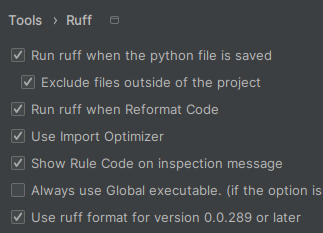

# Code Style, linters, formatters

Зазвичай є рекомендації, що стосуються певного стилю коду.

Наприклад, для Python є pep8:

https://peps.python.org/pep-0008/

Слідувати гарному стилю коду нам може допомогти IDE.
Середа розробки може візуально підказувати нам, що щось не так.
Наприклад, через підсвічування та підкреслення.

Також IDE може допомагати нам виправляти деякі речі.
Наприклад, у JetBrains PyCharm є автоформатування на hotkey `Ctrl + Alt + L`.

Але цей процес можна зробити ще краще.
Для цього є автоматичні інструменти, які перевіряють, чи, навіть, автоматично виправляють код.

Серед цих інструментів можна виділити, щонайменше, такі групи:

- Форматери
  - автоматично змінюють стиль коду згідно з певними правилами
- Лінтери
  - аналізують код на потенційні помилки та проблеми. Можуть навіть виправляти частину проблем.

## Помічник, а не перешкода

Пам'ятайте, ці інструменти повинні допомагати, а не заважати.

Якщо все це бути працювати занадто довго,
чи із цим буде працювати занадто складно,
то великі шанси, що це буде ігноруватися.
Тому іноді краще менше інструментів, але які гарно працюють.

Це також стосується правил для інструментів.

Так, хочеться, щоб усе було ідеально.

Але якщо на поточний момент ваш проєкт не готовий до цього,
то може є сенс вимкнути якісь правила, чи навіть інструменти, на час міграції.

## Доступність

Бажано, щоб усі ці інструменти міг запустити кожен,
хто розгортає у себе ваш репозиторій для розробки.

Іноді для цього потрібно додати можливість спрощено встановити потрібні інструменти.

Це, у якомусь сенсі, вирішує гарно організований процес CI/CD.

Але цього може бути недостатньо.

---

# Pre-commit hooks

Є інструмент “Pre-commit”:

- https://pre-commit.com/
- https://github.com/pre-commit/pre-commit

Він дозволяє запускати інструменти, наприклад, перед тим як буде зроблений commit.
Тут є більше варіантів:

https://pre-commit.com/#supported-git-hooks

## Чому pre-commit?

Узагалі, подібний функціонал можна реалізувати не тільки через інструмент.

Можна просто через git:

- https://git-scm.com/book/ms/v2/Customizing-Git-Git-Hooks

Але через цей інструмент може бути простіше.

## Аналоги

- prek
  - https://github.com/j178/prek
  - на rust. Зараз розробляється.
  - Сподіваюсь, колись він стане production-ready. Тоді, імовірно, я б перейшов на нього.
- husky
  - https://typicode.github.io/husky/
  - https://github.com/typicode/husky
  - скоріше для світу JS.

## Чому запускати локально?

Може бути набагато зручніше, коли є можливість запустити всі перевірки в себе.
І одразу виправити можливі проблеми.
Особливо якщо є можливість усе запустити.

Також у приватних репозиторіях можуть бути деякі обмеження щодо використання CI/CD.
Банально, це може коштувати додаткових грошей.
І, наприклад, у пет-проєктах чи академічних проєктах, теж хочеться використати різні автоматичні перевірки.
Pre-commit — один із варіантів, як можна це організувати.

Також локальний запуск може бути набагато простіший.

Урешті-решт, якщо є можливість, то гарно зробити як локальний запуск перевірок, щоб швидко виправити можливі проблеми,
так і запуск їх у CI/CD.

## Які інструменти можно використовувати?

Ви можете використовувати у pre-commit окремі інструменти, які створені як репозиторії,
які ви реєструєте в конфігураційному файлі.
Наприклад, як тут:

https://pre-commit.com/#2-add-a-pre-commit-configuration

Також ви можете використовувати локальні інструменти.
Наприклад, що встановлюються у ваше “віртуальне оточення” чи в систему.

https://pre-commit.com/#repository-local-hooks

Ці інструменти можуть бути зроблені як на Python, так і на інших мовах.

І, відповідно, pre-commit можна використовувати як для проєктів на Python, так і для інших мов.

Інструменти є для різних сценаріїв.

За бажанням, ви можете створити та додати щось своє.

Інструменти, додані через посилання на репозиторій, будуть автоматично встановлені в ізольоване оточення.

## Встановлення pre-commit

Його можна додати як dev-залежність у ваш проєкт.

Але я використовую його не тільки для проєктів на Python.
Тож я встановлюю його в систему. І вам раджу.

Завдяки [uv](https://docs.astral.sh/uv/) це зробити ще дуже просто.

Є ще варіант з pipx. Але uv його замінює.

Команда з установлення та оновлення. Можна запускати повторно.

```shell
uv tool install pre-commit --upgrade
```

## Ініціалізація pre-commit

Для того, щоб хуки працювали, їх потрібно зареєструвати в конкретному репозиторії у системі шіт-хуків.

У випадку із цим інструментом, достатньо зареєструвати тільки один раз після клонування/створення репозиторію.

Але потрібно це робити кожного разу, коли ви клонуєте/створюєте репозиторій.

Після зміни файлу з хуками, повторно реєструвати не потрібно.

Можна зробити це частиною команди зі встановленням залежностей, створенням оточення та інше.

Команда для реєстрації:

```shell
pre-commit install
```

## Запуск pre-commit

Ви можете запустити всі інструменти на всі файли з Pre-commit через команду:

```shell
pre-commit run --all-files
```

Це може бути особливо актуально, якщо ви змінювали налаштування для інструментів.

Ви можете інструмент на якусь папку
[таким чином](https://pre-commit.com/#pre-commit-run:~:text=git%20ls%2Dfiles%20%2D%2D%20%27*.py%27%20%7C%20xargs%20pre%2Dcommit%20run%20%2D%2Dfiles):

```shell
git ls-files -- your/folder | xargs pre-commit run --files
```

Але більшу кількість разів він буде запускатись автоматично перед комітом.

При необхідності, ви можете пропустити запуск pre-commit перед комітом. Але краще так не робити.

Також, якщо щось змінилось у файлах у процесі роботи інструментів, то коміт буде скасовано.
Щоб ви могли передивитися зміни.
Повторний коміт, без змін, буде збережено.

## Виключення

У вас можуть теки/файли, контент яких генерується автоматично, чи керується чимось зовнішним.
І ви не хочете, щоб на них спрацьовували якісь інструменти взагалі.

Тож ви можете додати їх у виключення. На верхньому рівні, чи на рівні конкретного хука.

Наприклад:

```yaml
exclude: |
  (?x)^(
    \.idea/.*
    )$
```

чи

```yaml
exclude: |
  (?x)^(
    \.idea/.*|
    some_file.txt
    )$
```

---

# Перевірка коду та CI/CD

За бажанням, можна прив’язати перевірку коду до одного з етапів CI/CD.
Наприклад, у GitHub actions:

- GitHub Actions. Docs.
  - https://docs.github.com/en/actions
- GitHub Actions. Syntax for workflows.
  - https://docs.github.com/en/actions/using-workflows/workflow-syntax-for-github-actions#about-yaml-syntax-for-workflows
- GitHub Actions. Some actions.
  - https://github.com/actions

Зокрема, можна використати дію для pre-commit:

- https://github.com/pre-commit/action

Тобто, pre-commit не ставить метою повністю замініти запуск різних перевірок під час CI/CD процесів.
Особливо у проєктах з великою командою. Де хтось може пропустити запуск pre-commit локально.

Але він може бути частиною цього процесу.

Чи реалізувати через себе частину цього процесу в особливих обставинах.

---

# Editor config

https://editorconfig.org/

Суть.
Можете створити файл `.editorconfig`.
У якому задати якісь особливі налаштування щодо стилю коду різних файлів.

Різні IDE можуть прислухатися до цієї конфігурації.

Не сказати, щоб це було часто потрібно. Бо є різні форматери.

Але колись бувало корисно.

---

# Інструменти

Є багато цікавих інструментів.

Для екосистеми Python вам можуть бути корисні щонайменше такі:

- Ruff
- MyPy

## Ruff

Лінтер та форматер, який має в собі можливості від інших інструментів.

https://docs.astral.sh/ruff/

Інструменти, які він може замінити:

- PyUpgrade
  - https://github.com/asottile/pyupgrade
  - Оновлює синтаксис коду
- Black
  - https://black.readthedocs.io/en/stable/
  - Автоматично форматує код.
- Flake8
  - https://flake8.pycqa.org/
  - Перевіряє деякі речі відповідно до pep8

Плагін для PyCharm:

- https://plugins.jetbrains.com/plugin/20574-ruff
  - Потрібно активувати для кожного проєкту в налаштуваннях.
    Може, навіть, зберегти відповідний файл з налаштуваннями у `.idea`.
  - 

Для використання цього плагіну (і не тільки) раджу встановити ruff у систему:

```shell
uv tool install ruff &&\
uv tool upgrade ruff
```

Налаштувати роботу інструмента для проєкту можна у `pyproject.toml`.

Я б радив активувати всі правила. А потім прибрати ті, що заважають. Наприклад так:

```toml
[tool.ruff]
line-length = 120

extend-exclude = [
]

[tool.ruff.lint]
extend-select = [
    "ALL",
]
extend-ignore = [
    # Missing docstring.
    "D1",
    # flake8-future-annotations.
    "FA",
    # Missing type annotation for self and cls.
    "ANN1",
    # f-strings to format logging messages.
    "G004",
    # Consider {expression} instead of string join.
    "FLY002",
    # TODO: Remove after this will be better implemented in the IDE (refactoring with moving).
    # Type alias {name} uses TypeAlias annotation instead of the type keyword
    "UP040",
    # TODOs
    # Author.
    "TD002",
    # Link to issue
    "TD003",
    # Line contains a TODO or related comment
    "FIX",
    # Args and kwargs are not used and not annotated
    "ANN002",
    "ANN003",
    # Commented code
    "ERA001",
    # empty-comment
    "PLR2044",
    #
    #
    # print used.
    # "T201",
]

task-tags = [
    "TODO",
    "FIXME",
    "HACK",
    "XXX",
    "[",
]

[tool.ruff.lint.pydocstyle]
convention = "google"
# https://betterprogramming.pub/3-different-docstring-formats-for-python-d27be81e0d68

[tool.ruff.lint.flake8-comprehensions]
allow-dict-calls-with-keyword-arguments = true

[tool.ruff.lint.extend-per-file-ignores]
"__init__.py" = [
    # Unused import.
    "F401",
]

"test_*.py" = [
    # Allow `assert` statements in tests.
    "S101",
]
```

Адаптуйте це під свої потреби.

Усі правила є тут: https://docs.astral.sh/ruff/rules/

Для кожного правила там є пояснення. Іноді з допоміжними статтями.

Тобто, цей лінтер може бути для вас також інструментом освіти.

Налаштування у pre-commit може бути таким:

```yaml
repos:
  - repo: https://github.com/astral-sh/ruff-pre-commit
    # Ruff version.
    rev: v0.13.3
    hooks:
      - id: ruff-check
        # Run the linter.
        args: [--fix, --unsafe-fixes]
      - id: ruff-format
        # Run the formatter.
```

## MyPy

Статичний аналізатор типів.

https://mypy.readthedocs.io/

Для Python це може бути особливо актуально.
Вам не так часто потрібна максимальна динамічність.
А анотації типів можуть підвищити передбачуваність вашого додатка.

Для якіснішої інтеграції mypy з вашим додатком, з урахуванням його актуальних залежностей,
є сенс установити його як dev-залежність.

Наприклад:

```shell
uv add --dev mypy
```

Для деяких бібліотек також доведеться встановлювати допоміжні бібліотеки саме з інформацією про типи.
Наприклад:

- pandas
  - pandas-stubs
    - https://pypi.org/project/pandas-stubs/
- scipy
  - scipy-stubs
    - https://pypi.org/project/scipy-stubs/
- requests
  - types-requests
    - https://pypi.org/project/types-requests/

Їх теж можна додати як dev-залежності.

У `pyproject.toml` можна додати [налаштування](https://mypy.readthedocs.io/en/stable/config_file.html#confval-strict)
для mypy:

```toml
[tool.mypy]
strict = true
```

Інформація про версію Python буде взята
з [версії інтерпретатора](https://mypy.readthedocs.io/en/stable/config_file.html#confval-python_version).
Це ще одна причина запускати саме mypy із середовища додатка.

Конфігурація для pre-commit:

```yaml
repos:
  - repo: local
    # Hooks with local scripts.
    hooks:
      - id: mypy
        # Static type checker for Python.
        name: mypy
        entry: uv run mypy
        language: system
        types: [python]
        # hook will execute using a single process instead of in parallel
        require_serial: true
```

### Потенційні аналоги

- ty
  - https://docs.astral.sh/ty/
  - https://github.com/astral-sh/ty
  - Поки що в активній розробці. Не production-ready.
  - Від astral. Автори uv та ruff.
  - Може стати цікавою альтернативою mypy у майбутньому.
- Pyrefly
  - https://pyrefly.org/
  - https://github.com/facebook/pyrefly
  - В активній розробці. Поки що може не підтримувати все, що mypy. Треба тестити.
  - Від Facebook.

### Навіщо анотації

На жаль, через то що анотації, зазвичай, ні на що не впливають під час виконання,
то може здаватися, що користь від них не дуже велика.
І гарантій ніяких.

Тому це краще працює разом з використанням бібліотек, які використовують типи у runtime.
Щонайменше для валідації.
Наприклад:

- pydantic
  - https://docs.pydantic.dev/latest/
  - Краще створення класів з валідацією полів. (`BaseModel`)
  - Декоратор для валідації функції `validate_call` (можна використати в граничних місцях).
  - Серіалізація/Десеріалізація JSON тощо.
  - https://docs.pydantic.dev/latest/why/#dataclasses-typeddict-more
- typer
  - https://typer.tiangolo.com/
  - для створення консольних додатків з використанням інформації з анотацій
- fastapi
  - https://fastapi.tiangolo.com/
  - для створення вебдодатків з використанням інформації з анотацій
- django-typer
  - https://django-typer.readthedocs.io/en/stable/
  - typer, але для Django.
- django-ninja
  - https://django-ninja.dev/
  - як FastAPI, але для Django.
  - https://eadwincode.github.io/django-ninja-extra/

І т.і.

## Sourcery

Інструмент, який може пропонувати покращення коду. Корисний для рефакторингу.

https://sourcery.ai/

На жаль, комерційний. Тож не всім доступний. І при цьому не критичний для придбання.
Враховуйте це, якщо плануєте його додавати.

І він був відносно повільним на великій кодовій базі.

Має інтеграцію
з [PyCharm](https://docs.sourcery.ai/Getting-Started/Setting-Up-Your-Account/Adding-Sourcery-to-Your-IDE/#setting-up-sourcery-in-jetbrains-ides).

Налаштування pre-commit, якщо будете його додавати.

```yaml
repos:
  - repo: https://github.com/sourcery-ai/sourcery
    rev: v1.34.0
    # Advanced refactorings for Python.
    # Hide it if you can't use it.
    # It's a paid service (?). So, you need to register and login.
    # You try it by registering and logging in.
    # For example, referral link: https://sourcery.ai/invite/cybylQgr
    # More details: https://docs.sourcery.ai/Coding-Assistant/Guides/Getting-Started/Pre-Commit/
    # Login: https://docs.sourcery.ai/Coding-Assistant/Guides/Getting-Started/Command-Line/#login
    hooks:
      - id: sourcery
        # The best way to use Sourcery in a pre-commit hook:
        # * review only changed lines:
        # * omit the summary
        #  args: [ --diff=git diff HEAD, --no-summary, --fix ]
        args: [--no-summary, --fix]
```

Я використовую його, коли потрібен рефакторинг. І як плагін в IDE. У цьому плані він мені дуже допомагає.

У pre-commit не використовую.

## Mega-linter

У ньому є багато перевірок. (Але можуть бути складнощі із запуском і налаштуванням.)

https://megalinter.io/latest/

У ньому може бути прям дуже багато інструментів:

https://megalinter.io/latest/supported-linters/

Але деякі інструменти краще працюють і налаштовуються при використанні як окремий інструмент.

Радив би використовувати скоріше для натхнення щодо цікавих інструментів, про які ви могли не знати.

---

# Інші інструменти для pre-commit

## pre-commit-hooks

Різні корисні дії.

https://github.com/pre-commit/pre-commit-hooks

Наприклад:

```yaml
repos:
  - repo: https://github.com/pre-commit/pre-commit-hooks
    rev: v6.0.0
    hooks:
      - id: check-merge-conflict
        # Check for files that contain merge conflict strings.
      - id: trailing-whitespace
        # Trims trailing whitespace.
        args: [--markdown-linebreak-ext=md]
      - id: end-of-file-fixer
        # Makes sure files end in a newline and only a newline.
        # Exclude some autogenerated files.
      - id: check-yaml
        # Checks that your YAML files are parseable.
      - id: check-toml
        # Attempts to load all TOML files to verify syntax.
      - id: check-json
        # Checks that all JSON files are parseable.
      - id: check-added-large-files
        # Prevent giant files from being committed.
        args: [--maxkb=500]
```

## pre-commit-update

Автооновлення версій інших хуків.

https://pypi.org/project/pre-commit-update/

```yaml
repos:
  - repo: https://gitlab.com/vojko.pribudic.foss/pre-commit-update
    # https://pypi.org/project/pre-commit-update/
    rev: v0.8.0
    hooks:
      - id: pre-commit-update
```

## uv-pre-commit

Різні дії пов'язані з uv.

https://github.com/astral-sh/uv-pre-commit

Наприклад:

```yaml
repos:
  - repo: https://github.com/astral-sh/uv-pre-commit
    rev: 0.9.1
    hooks:
      - id: uv-lock
```

## prettier

Форматер для різних текстових файлів.

https://prettier.io/

https://github.com/JoC0de/pre-commit-prettier

Наприклад:

```yaml
repos:
  - repo: https://github.com/JoC0de/pre-commit-prettier
    rev: v3.6.2
    hooks:
      - id: prettier
        files: \.(json|ya?ml|md)$
```

На жаль, він дуже змінивсь у нових версіях. І pre-commit хук поки що не оновлюється.

Тож краще знайти щось нове.

Але це поки що працює. Тож ок.

## Кастомне локальне

Нагадую, ви можете додати будь-що як хук.

Наприклад, запуск тестів:

```yaml
repos:
  - repo: local
    # Hooks with local scripts.
    hooks:
      - id: pytest
        name: pytest
        entry: uv run pytest
        language: system
        pass_filenames: false
```

Чи запуск генерації якихось файлів. Чи запуск якихось важливих команд. Все, що вам потрібно.

Можете навіть додати щось на етап [`manual`](https://pre-commit.com/#confining-hooks-to-run-at-certain-stages). Який не
буде спрацьовувати ніколи, окрім особливого запуску:

```shell
pre-commit run --hook-stage manual
```

---
